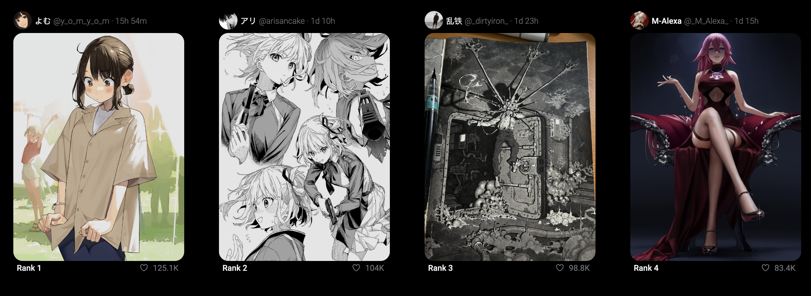

# Mangastyle

UPDATE: Temporarily shutdown the site cuz I ran out of free tier on AWS.

UPDATE: It is with regret that Twitter API is no longer free since companies began abusing Twitter API en masse for training data for LLMs—understandable. Side effect is smaller projects like mine can no longer get real-time data. However, before the shutdown I was able to get an impressive **414K+** viral manga-style art tweets! So this website is still of immense value to artists and those who love manga-style art.

Mangastyle uses the twitter api to gather data in real-time on manga-style art. It ranks the art based on the number of likes received and features detailed filtering so you can find the most recent trending art.

Visit [mangastyle.lol](https://mangastyle.lol/).

If you are an artist or you love digital art, this website may be something you want to check out. 
